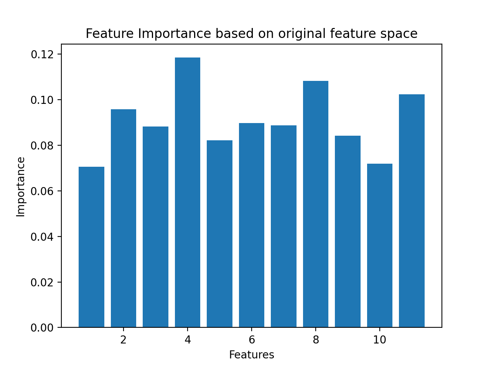
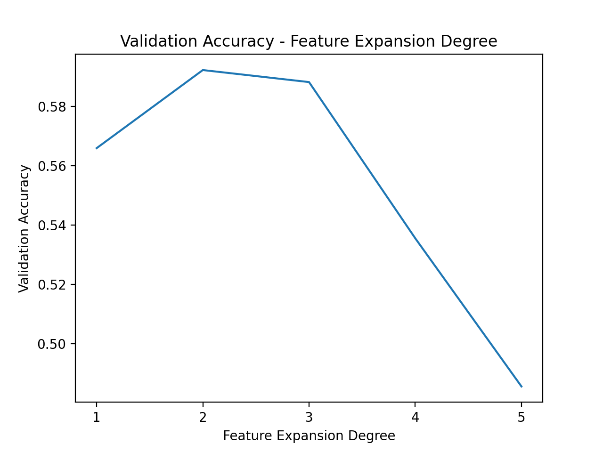
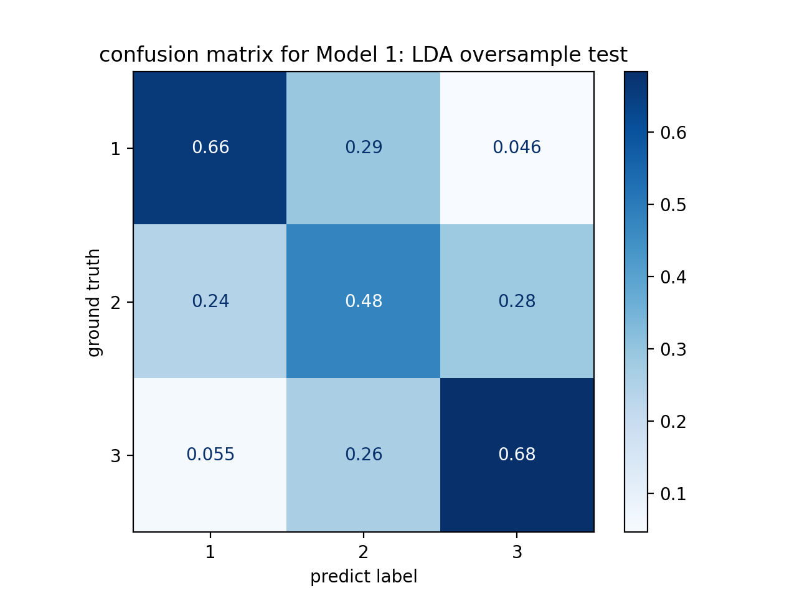

# Wine Quality Classification

<!-- TABLE OF CONTENTS -->

  
Table of Contents

  <ol>
    <li><a href="#about-the-project">About The Project</a></li>
    <li><a href="#contents">Contents</a></li>
    <li><a href="#screenshots">Screenshots</a></li>
    <li><a href="#built-with">Built With</a></li>
      <ul>
          <li><a href="#installation">Installation</a></li>
      </ul>
    <li><a href="#author">Author</a></li>
    <li><a href="#license">License</a></li>
  </ol>

## About The Project

This project I choose the [Wine Quality Dataset (White)](https://archive.ics.uci.edu/ml/datasets/Wine+Quality), which the original dataset is from the UCI Machine Learning Repository. The data is from the real world and each of the features will decide the quality of the wine quality. But, in my experiment, part of the dataset has been pre-processed. The dataset includes **11 features** (fixed acidity, volatile acidity, var1*, var2*, chlorides, free sulfur dioxide, total sulfur dioxide, density, pH, sulphates and var3*, where var1*, var2*, var3* are the three features that has been pre-processed from the alcohol, residual sugar and citric acid) and **3 classes** (class 1 is good, class 2 is medium, and class 3 is bad quality).

The goal is that I use some pre-processing techniques on the wine training and testing set to process the data, then implement several classification algorithms by validation or cross-validation to find good classification models, and finally use the best models I get to classify the test set to see the model performance for the unknown dataset by the accuracy, macro f1 score and confusion matrix three measurements. Because the dataset is biased, I compare the oversampling and undersampling meethods to see the different performance.

## Contents

## Screenshots
 

  
  
  

## Built With
- [Python 3.7.4](https://www.python.org/downloads/release/python-374/)

### Installation
This code built and tested with Python 3.7.4, included package scikit-learn 1.0.1, pandas 1.3.4, numpy 1.21.4, scipy 1.7.2, matplotlib 3.4.3, and seaborn 0.11.2.

<!--## further improvement-->

## Author

**Shuai Xu** | University of Southern California

[Profile](https://github.com/sxu75374) - <a href="mailto:sxu75374@usc.edu?subject=Nice to meet you!&body=Hi Shuai!">Email</a>

Project Link: [https://github.com/sxu75374/Wine-Quality-Classification](https://github.com/sxu75374/Wine-Quality-Classification)

<!-- LICENSE -->
## License

Distributed under the MIT License. See `LICENSE.md` for more information.

[<a href="#top">back to top</a>]

